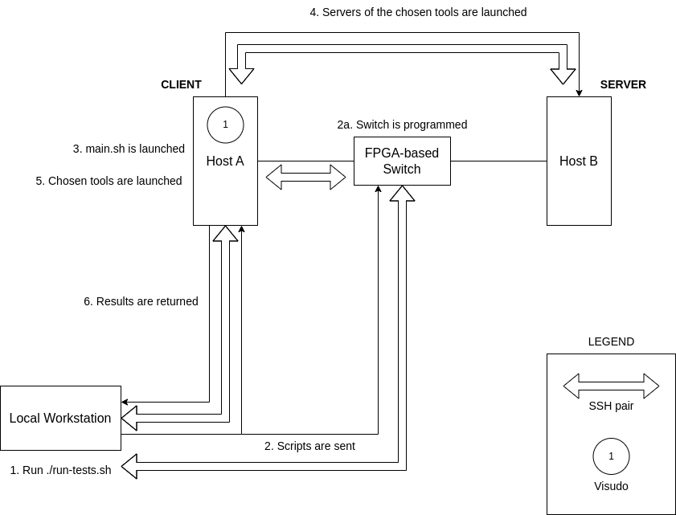

## Introduction 
This project includes a set of scripts aimed to measure the performance of a network connection. Because these scripts were destined to test a FPGA-based network where some of the designs were time-restricted, there is acouple of scripts that are used to re-program one of the FPGAs. It includes a script to parameterize a set of options used by the test, and which has to be adapted to each user needs. The following Figures the most relevant steps carried out when running these script.

<ol>
    <li>1. The user has to launch the `run-tests.sh` script in the local workstation. At this step, the user is requested to select which prototype are the tests going to be launched on (right now, only the Local prototype is supported) and what connection is going to be launched. These is done for organization puposes, so the results from one prototype-configuration pair don't get mixed with another.</li>
    <li>2. The scripts are sent to the client host and the switch, so they can be launched from there.</li>
    <li>2a (Optional). The scripts used to configure the FPGA as a switch are launched.</li>
    <li>3. The `main.sh` script is launched, which in turn launches the scripts for the selected tools. At this step, the user is requested to select the tools to be launched. The default behavior is to launch every tool. </li>
    <li>4. The client host launches the tools on the server-side of the connection.</li>
    <li>5. The client launches the tests for the chosen tools.</li>
    <li>6. The client host returns the files containing the results generated for every tool.</li>
</ol>



This repo contains the following scripts:
<ul>
    <li>format-box-plot-data.py (Deprecated): this python script was used to transform the boxplot data into a gnuplot-readable format. It has been replaced by a set of R scripts.</li>
    <li>latency-qperf.sh: it performs several `qperf` tests and measures the average latency. It needs further work.</li>
    <li>main.sh: this is the script meant to be launched in the prototype. It launches the tests designed for the different tools. From this script, you can type the number of runs that each tool is going to perform, as well as the duration of each run.</li>
    <li>run-tests.sh: this script is meant to be launched from a local workstation. This script calls the `main.sh` script in the remote side (the prototype) and brings back the results.</li>
    <li>throughput-iperf3.sh: this script sets the `iperf3` connection and gathers the data necessary to make boxplots and performance comparisons between different buffer sizes for TCP and UDP.</li>
    <li>throughput-netperf.sh: this script sets the `netperf` connection and gathers the data necessary to make boxplots and performance comparisons between different buffer sizes for TCP and UDP.</li>
    <li>throughput-nuttcp.sh: this script sets the `nuttcp` connection and gathers the data necessary to make boxplots and performance comparisons between different buffer sizes for TCP and UDP.</li>
    <li>program-switch.sh: this scripts reads the `reference-switch.tcl` script to configure the FPGA acting as a switch.</li>
    <li>reference-switch.tcl: this script launches the `xsct` tool and runs the instructions necessary to configure the FPGA. It only works for FPGAs that can be configured with this tool.</li>
    <li>settings.sh: this script has a set of variables that are used to parameterize the tests, such as the number or duration of the tests.</li>
</ul>

Overall, these scripts provide a way to automate the execution of different network testing tools. Currently, the following testing tools are included:

- iperf3
- netperf
- nuttcp

## Installation

### Testing tools
For the scripts to work it is necessary to download the tools that the different scripts use:

```
sudo apt update
sudo apt install iperf3 netperf nuttcp
```

### Vivado/Vitis
If the connection includes a switch design with a time-restricted usage it will be necessary to install the Vivado/Vitis suite in the corresponding PC, as it includes the `xsct` tool. **NOTE**: before installing this tool, you have to make sure that the FPGA model you are using can be programmed in this manner.

### SSH keys
Because several files are transfered between the hosts, it is necessary to avoid the password request prompt, as it would stuck the automation of the process until we type the password. Thus, before launching the scripts, it is necessary to set the SSH key authentication between the host that is going to launch the tests and the local workstation.

### Passwordless sudo

As the `main.sh` has to be run as root, the `passwd` file has to be modified (running `sudo visudo`) to include the following line:

```
<USER> ALL=(ALL:ALL) NOPASSWD:/home/<USER>/scripts/main.sh, /bin/rm
```
This line skips password authentication for <USER> for the `main.sh` scritp and the `rm` instruction (as the folders are created as sudo, they also have to be removed by sudo).

## Usage

You just have to run the main script as sudo by typing `sudo ./main.sh`. This script will prompt you with questions about which tests you want to launch, in case you just want to launch a specific tool. By now, you have to choose the tool with a 1 (yes) or a 0 (no)

The script will generate two directories: `logs` and `results`. The `logs` directory contains the output of the execution of the given tool, while the `results` directory contains the data extracted from the output of the given tool.

### Examples of usage

- To run each tool 20 times during 5 seconds each one, modify the `TESTS` and `TEST_DURATION` values to 20 and 5 respectively. Then run the `run-tests.sh` script or the `main.sh` script.

- To run the performance tests directly withing the prototype run `sudo ./main.sh` and choose select just the `iperf3` option, then two sets of files will be created: one under the `iperf3` directory within the `log` directory, and another set under the `iperf3` directory within the results` directory.

- To run the performance tests from a local workstation (or from gitlab), run the `run-tests.sh` script.


## Contributing

Pull requests are welcome. For major changes, please open an issue first
to discuss what you would like to change.

Please make sure to update tests as appropriate.

## License

[MIT](https://choosealicense.com/licenses/mit/)
